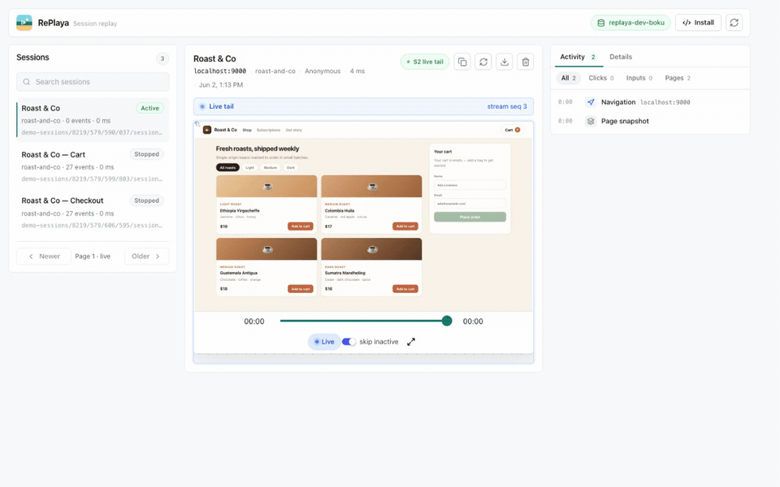

<p align="center">
  
</p>

# RePlaya

Self-hosted session replay built on [S2](https://s2.dev/). Each session is stored as one S2 stream, and that stream is the whole backend — there's no separate database, message bus, object store, or search index. Because an S2 stream can be tailed as it's written, RePlaya can replay a session live, while the visitor is still on the page, as well as play back finished ones. Add the recorder snippet to your site and sessions are stored as streams you can replay, live-tail, filter, and export.

## Demo

<p align="center">
  
</p>

<p align="center"><em>A new session appears in the list and is live-tailed from its S2 stream — the replay and activity feed update as the visitor uses the app. (<a href="docs/demo.mp4">MP4</a>)</em></p>

## Quickstart

You'll need an S2 access token and a basin. Put them in `.env.local`:

```bash
S2_ACCESS_TOKEN=replace-with-an-s2-access-token
S2_BASIN=replaya-your-name
PORT=8787
```

The basin is created on first use with RePlaya's stream defaults. The dashboard's health pill reports the basin and the effective S2 endpoints so you can confirm what you're pointed at. To use [s2-lite](https://github.com/s2-streamstore/s2#s2-lite) or another compatible deployment instead of S2 Cloud, set the endpoints explicitly:

```bash
S2_ACCOUNT_ENDPOINT=http://localhost:7070
S2_BASIN_ENDPOINT=http://localhost:7070
```

Then install dependencies and start the dev server:

```bash
pnpm install
pnpm dev
```

The API runs on `http://localhost:8787` and Vite serves the dashboard on `http://localhost:5173`. To create a test recording without instrumenting another app, open `http://localhost:8787/recorder-test`; it records through the same hosted recorder script.

For a production-style local run, build and serve everything from Express on one port:

```bash
pnpm build
pnpm start
# open http://localhost:8787
```

## Drop-in recorder

Add this to any page to start capturing, pointing it at your RePlaya host:

```html
<script>
  !function(w,d,s,u){w.replaya=w.replaya||function(){(w.replaya.q=w.replaya.q||[]).push(arguments)};var e=d.createElement(s);e.async=1;e.src=u;d.head.appendChild(e)}(window,document,"script","https://replaya.example.com/recorder.js");
  replaya("init", {
    apiHost: "https://replaya.example.com",
    source: "web-app"
  });
</script>
```

In local development that host is `http://localhost:8787`, and `/recorder-test` serves a page that records through the same script.

`source` is optional metadata for grouping captures by app, site, environment, or tenant. `distinctId` and `userId` can be passed to tag sessions with application identity.

By default, the recorder **masks all input, select, and textarea values** (rrweb `maskAllInputs`), so end-user keystrokes — passwords, emails, anything typed — are never sent to the server. To capture raw form control state on a page where that's acceptable (e.g. an internal admin UI), pass `maskAllInputs: false` to `replaya("init", ...)`, or add `data-mask-all-inputs="false"` to the recorder script tag.

Masking covers input values only; text the page renders into the DOM is still recorded. Wrap sensitive regions in the `replaya-block` class to omit them from the recording, or `replaya-ignore` to skip a subtree's changes.

In production, keep the dashboard and read APIs private and expose only the collector routes publicly; see [Configuration & deployment](#configuration--deployment).

## How it works on S2

A session recording is a log: an append-only, ordered, timestamped sequence of events. RePlaya stores each session as one S2 stream and reads it back the same way, so a single primitive covers what's often split across several systems.

- **Storage.** rrweb events are appended to the tail of the session's stream over the S2 Producer API, which batches with backpressure and acks each batch once it's durable. The stream is the recording — there's no separate blob store, and nothing buffers on the server between ingest and storage. Large rrweb events are framed across multiple S2 records and reconstructed on read.
- **Timeline.** Session streams use `timestamping.mode: client-require`, so the rrweb capture time is written into each event record's S2 timestamp and read back as the scrub timeline. (Create, stop, and heartbeat records use server wall-clock time.)
- **Listing.** S2 lists streams in lexicographic order, so each stream is named `sessions/<inverted timestamp>`; `streams.list({ prefix: "sessions/" })` then returns newest-first with `startAfter` paging — no database keeping an order in sync. A best-effort sidecar index stream is tailed to update the list as new sessions start.
- **Live tail.** `GET /api/sessions/:id/live` opens an S2 read session from the snapshot tail and bridges new records to the browser over SSE, where they're appended to the mounted player. The same stream serves both the historical scrub and the live edge.
- **Concurrency.** Stream creation and stop write `active` / `stopped` fencing tokens; event and heartbeat appends are fenced on `active`, so a finished session can't be resurrected by a late writer.

Streams are created on first append (`createStreamOnAppend`), inheriting the basin's default config, so there's no stream provisioning to manage. That leaves one external dependency: point RePlaya at [S2 Cloud](https://s2.dev/), or at a self-hosted [s2-lite](https://github.com/s2-streamstore/s2#s2-lite) to keep everything in your own infrastructure. Recordings live in your own basin — URI-addressable, with configurable retention and on-demand deletion. The browser never receives the S2 token; all S2 reads and writes go through the RePlaya server.

For comparison with a typical session-replay backend:

| | Typical replay backend | RePlaya |
| --- | --- | --- |
| Services to run | Message bus, analytics store, relational DB, object store, search index | One Node server + S2 |
| Live sessions | Usually playback after an ingest/flush delay | Live tail of active sessions, off the same stream |
| Stored recording | Blobs in object storage; metadata across databases | One ordered S2 stream per session |
| Self-host footprint | A multi-service cluster, often on Kubernetes | A single process + S2 (or self-hosted s2-lite) |

Dashboard search is a client-side filter over the sessions already listed — S2 provides ordering and newest-first listing, not full-text search. See [`ARCHITECTURE.md`](ARCHITECTURE.md) for the full design.

## Configuration & deployment

Server-only S2 configuration lives in `.env.local` (see [Quickstart](#quickstart)). The read side has **no built-in authentication by design** — the deployment boundary *is* the access control. In production, RePlaya treats the collector as public, write-only surface area and the dashboard/read APIs as private surface area.

1. **Don't expose the read APIs to the internet.** Bind the app to a private interface and put the dashboard, `GET /api/sessions*`, live tailing, and `/api/health` behind your SSO/access layer (VPN, Tailscale, Cloudflare Access, oauth2-proxy).
2. **Expose only the collector publicly** — `GET /recorder.js`, `GET /vendor/rrweb.min.js`, and the write endpoints (`POST /api/sessions`, `/events`, `/heartbeat`, `/stop`) — and lock those down with `REPLAYA_ALLOWED_CAPTURE_ORIGINS` + `REPLAYA_PROJECT_KEY`.
3. **Set `NODE_ENV=production`** so ingest auth is enforced, originless ingest is rejected, and the recorder test fixture is disabled.
4. **Set `REPLAYA_APPEND_TOKEN_SECRET`** to a stable random value (e.g. `openssl rand -hex 32`). With ingest auth enabled (the production default), the server refuses to start without it. Set `REPLAYA_TRUST_PROXY=true` if you run behind a reverse proxy so per-client rate limits use the real client IP.

```bash
NODE_ENV=production
REPLAYA_PROJECT_KEY=pk_live_replace_with_public_write_key
REPLAYA_APPEND_TOKEN_SECRET=replace-with-a-long-random-secret
REPLAYA_ALLOWED_CAPTURE_ORIGINS=https://app.example.com,https://www.example.com
REPLAYA_TRUST_PROXY=true
```

Then pass the public project key in the recorder init:

```js
replaya("init", {
  apiHost: "https://collect.example.com",
  projectKey: "pk_live_replace_with_public_write_key",
  source: "web-app"
});
```

Session create returns a short-lived append token that the recorder sends with event, heartbeat, and stop writes. Useful limits and knobs:

- `REPLAYA_SESSION_CREATE_RATE_LIMIT` default `60` per minute per client/project.
- `REPLAYA_SESSION_APPEND_RATE_LIMIT` default `600` per minute per client/session.
- `REPLAYA_MAX_EVENTS_PER_BATCH` default `100`.
- `REPLAYA_JSON_BODY_LIMIT` default `8mb`.
- `REPLAYA_APPEND_TOKEN_TTL_MS` default `86400000`.
- `REPLAYA_LOG_REQUESTS` — access log for every request. Defaults on in development, off in production; failed requests (4xx/5xx) are always logged.
- `REPLAYA_SHUTDOWN_GRACE_MS` default `10000`. On `SIGTERM`/`SIGINT` the server drains in-flight requests, drops lingering live-tail streams after ~3s, and hard-exits at the grace deadline.

See [`ARCHITECTURE.md`](ARCHITECTURE.md#security--request-boundary) for how the boundary, ingest auth, and append tokens fit together.

### Docker

```bash
docker build -t replaya .
docker run --rm -p 8787:8787 \
  -e NODE_ENV=production \
  -e S2_ACCESS_TOKEN=... -e S2_BASIN=... \
  -e REPLAYA_PROJECT_KEY=pk_live_... \
  -e REPLAYA_APPEND_TOKEN_SECRET="$(openssl rand -hex 32)" \
  -e REPLAYA_ALLOWED_CAPTURE_ORIGINS=https://app.example.com \
  replaya
```

The image runs the single compiled server (`node dist-server/server/index.js`) as a non-root user and includes a `HEALTHCHECK` against `/api/health`. Only the collector and recorder routes should be publicly reachable.

> Pass secrets with `-e VAR=value` (or a secrets manager), not by reusing a local `.env`. `docker --env-file` does not strip surrounding quotes the way `dotenv` does, so a quoted value like `S2_ACCESS_TOKEN="..."` would reach the container with the quotes included.

## Scripts

- `pnpm dev` starts the API and Vite.
- `pnpm build` type-checks the client/server and builds the frontend.
- `pnpm lint` runs ESLint.
- `pnpm test` runs the unit/smoke suite (recorder invariants + HTTP smoke). No S2 required.
- `pnpm test:integration` runs the S2 round-trip tests against a real S2 API.
- `pnpm start` serves the built frontend and API from Express.

## Testing

`pnpm test` covers recorder invariants and an HTTP smoke of the server (recorder delivery, security headers, ingest-auth rejection) without needing S2.

The integration tests exercise the real create → append → replay → delete path against [`s2 lite`](https://github.com/s2-streamstore/s2#s2-lite), the in-memory S2 emulator. They're skipped unless `S2_TEST_ENDPOINT` is set:

```bash
docker run -d -p 8080:80 ghcr.io/s2-streamstore/s2 lite
S2_TEST_ENDPOINT=http://localhost:8080 pnpm test:integration
```

CI runs both: a build/lint/unit-test job (Node 20 + 24) and an integration job that boots `s2 lite` and runs the round-trip suite.
